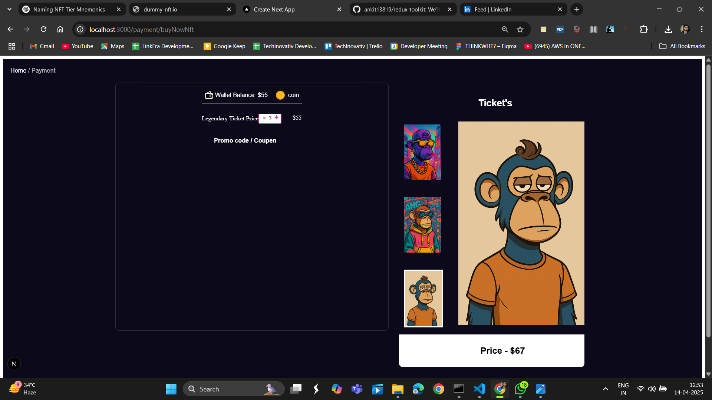

🚀 Buy & Sell Tickets – 

I’m working on a real-world project to master Redux, useReducer, and useEffect using Next.js and Material UI!

🎯 Project Goal:
Build a platform where users can Buy & Sell Tickets — while learning modern React state management from scratch to advanced levels.

🧠 Tech Stack & Concepts Covered:
✅ Next.js
✅ Material UI
✅ Redux Toolkit
✅ useReducer & useEffect
✅ Modern ES6+ React Practices

🔰 What You’ll Learn (From Beginner to Advanced):
Level	Concepts
Beginner	Actions, Reducers, Store, useSelector, useDispatch
Intermediate	Redux Toolkit, Slice Management, Async Thunks
Advanced	Feature-based folder structure, entityAdapter, middleware, devtools

📦 Create App
   npx create-next-app@latest folder_name
📦 Installation
   npm install @reduxjs/toolkit react-redux

🎨 Styling
Using Material UI + Material Styles for consistent and responsive design.

🔗 Bonus GitHub Repos:
👉 Herotv Frontend (Next + Redux Toolkit)
👉 useReducer Hook Example
👉 Redux Toolkit Demo

